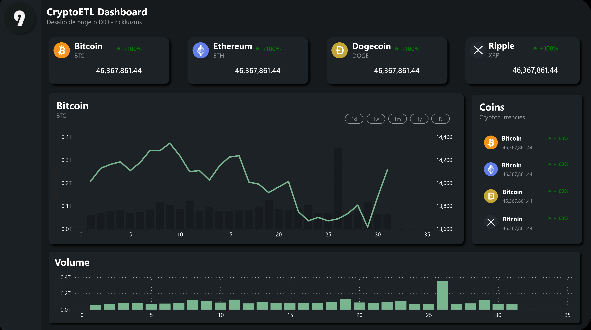

<a href="https://projectx-eight-gilt.vercel.app/">
  <h1 align="center">Crypto ETL: ETL de dados de criptomoedas</h1>
</a>

  Processo de ETL de dados de valores de abertura e fechamento de preço de criptomoedas.

  <!--  -->
  

  <a href="#"><strong>Power BI</strong></a> ·
  <a href="#"><strong>Azure Database</strong></a> ·
  <a href="#"><strong>SQL</strong></a> ·

 

## Introdução

Bem-vindo ao CryptoETL.
O CryptoETL é um projeto dedicado à extração, transformação e carga (ETL) de dados relacionados a criptomoedas. Utilizando a plataforma Azure, especificamente um banco de dados SQL, este projeto realiza a ingestão de dados provenientes da plataforma Kaggle, realiza transformações essenciais e utiliza o Power BI para a visualização dos dados processados.

## Dashboard:

## Estrutura do Diretório

    .
    ├── dashboard/                             # Diretório do Dashboard
    │    ├── icons/  
    |    ├── screenshots/
    |    ├── dio-dashboard-desafio2.pbix      # Dashboard para visualização
    │    └── todo.md                          # Task CheckList
    ├── pipeline/
    |   ├── data/
    |   ├── utils/                            # Scripts para pipeline
    |   ├── __init__.py                        
    |   ├── load.py                        
    │   └── pipe.ipynb                        # Pipeline de ingestão de Dados no banco
    ├── .gitignore            
    ├── README.md
    └── requirements.txt                      # Requirements do projeto

### Database

Para o projeto utilizamos um banco de dados SQLServer da plataforma Azure.

### Pipeline de dados

Processo de limpeza e transformação de dados antes da carga no banco de dados com Python.

### Dashboard - PowerBI

Na ferramenta PowerBI, utilizando o PowerQuery, importamos os dados do banco de dados Azure no nosso dashboard para visualização dos dados.

## Tech Stack + Features

### Platforms

- [Azure](https://azure.microsoft.com/en-gb/) – Plataforma de Hospedagem
- [Power BI](https://azure.microsoft.com/en-gb/) – Ferramenta de Visualização

## Referências de Dados

Os dados iniciais para este projeto foram obtidos da plataforma Kaggle. Gostaríamos de expressar nossa gratidão ao autor original do conjunto de dados:

- **Autor:** [Lasal Jayawardena](https://www.kaggle.com/datasets/lasaljaywardena)
- **Conjunto de Dados:** [Global Cryptocurrency Price Database](https://www.kaggle.com/datasets/lasaljaywardena/global-cryptocurrency-price-database/data)

## Referências dos Ícones de Criptomoedas

Os ícones das criptomoedas utilizados neste projeto foram obtidos do site [CryptoIcons](http://cryptoicons.co/). Gostaríamos de expressar nossa gratidão ao autor original desses ícones.

- **Site:** [CryptoIcons](http://cryptoicons.co/)

## Repo Activity

