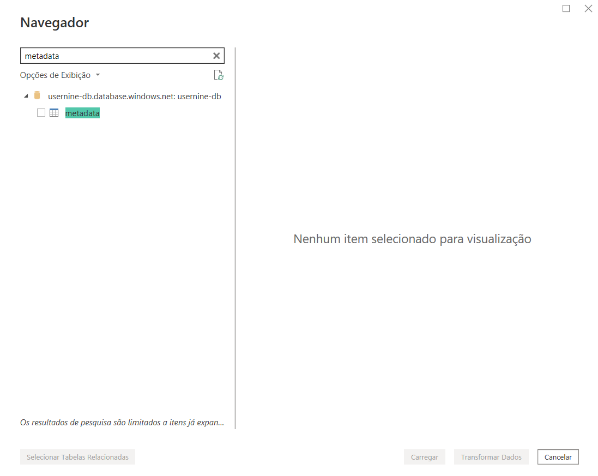
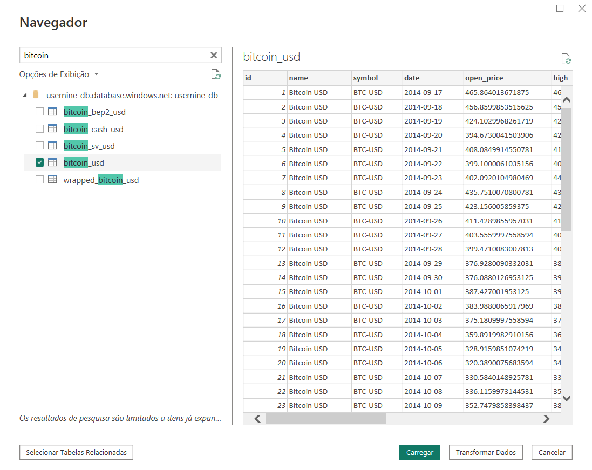
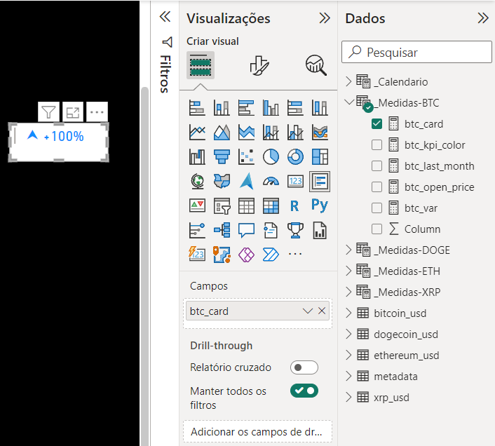
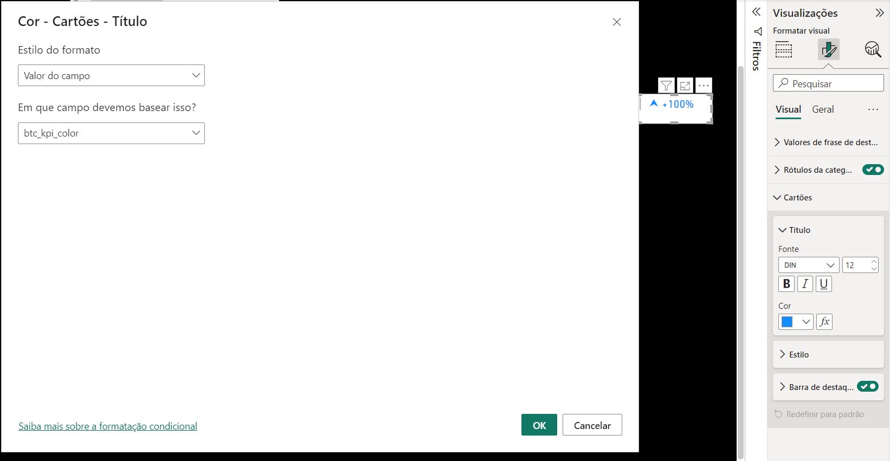
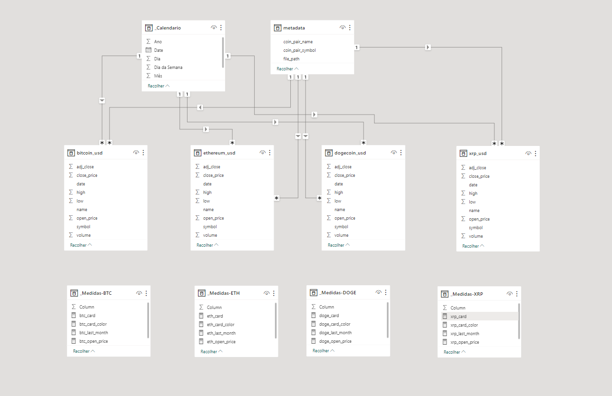

# Extração e Limpeza de dados no Power BI

## 1 - Importar dados do Banco de dados
- #### **Extração de Dados - Importação**

    - [x] Extrair tabela fato: metadata
    

    - [x] Extrair tabelas dimensão: bitcoin, ethereum, dogecoin, ripple
    
    

## 2 - Limpeza e Transformação de dados
- #### **Transformação de Dados - PowerQuery**

    - [x] Adicionar os tipos corretos na tabela fato

        ```
        let
            Fonte = Sql.Database("server", "database"),
            dbo_table = Fonte{[Schema="dbo",Item="table"]}[Data],
            #"Colunas Removidas" = Table.RemoveColumns(dbo_table,{"id"}),
            #"Linhas Filtradas" = Table.SelectRows(#"Colunas Removidas", each ([coin_pair_symbol] = "BTC-USD" or [coin_pair_symbol] = "DOGE-USD" or [coin_pair_symbol] = "ETH-USD" or [coin_pair_symbol] = "XRP-USD"))
        in
            #"Linhas Filtradas"
        ```

    - [x] Adicionar os tipos corretos nas tabelas dimensão

        ```
        let
            Fonte = Sql.Database("server", "database"),
            dbo_table = Fonte{[Schema="dbo",Item="table"]}[Data],
            #"Outras Colunas Removidas" = Table.SelectColumns(dbo_table,{"name", "symbol", "date", "open_price", "high", "low", "close_price", "adj_close", "volume"}),
            #"Tipo Alterado" = Table.TransformColumnTypes(#"Outras Colunas Removidas",{{"date", type date}}),
            #"Valor Substituído" = Table.ReplaceValue(#"Tipo Alterado",".",",",Replacer.ReplaceText,{"open_price", "high", "low", "close_price", "adj_close"}),
            #"Tipo Alterado1" = Table.TransformColumnTypes(#"Valor Substituído",{{"open_price", type number}, {"high", type number}, {"low", type number}, {"close_price", type number}, {"adj_close", type number}, {"volume", Int64.Type}})
        in
            #"Tipo Alterado1"
        ```

## 3 - Criar Medidas
- #### **Criar medidas e tabelas personalizadas para o relatório**

    - [x] **Medidas Bitcoin**

        - [x] Soma do Valor Total (Periodo analisado)

            ```
            btc_open_price = sum(bitcoin_usd[open_price])
            ```

        - [x] Periodo Anterior (Periodo analisado anterior para comparação)

            ```
            btc_last_month = CALCULATE([btc_open_price], PREVIOUSMONTH(_Calendario[date]))
            ```

        - [x] Variação do Valor (Valor total - soma periodo anterior)

            ```
            btc_var = DIVIDE([btc_open_price]-[btc_last_month],[btc_open_price],0)
            ```

        - [x] Card Color

            ```
            btc_card_color = 
            VAR vPerc = [btc_var]

            RETURN
                SWITCH(
                    TRUE(), 
                    vPerc > 0, "GREEN",
                    vPerc < 0, "RED",
                    "GRAY"
                )
            ```

        - [x] Card

            ```
            btc_card = 
            VAR vPerc = [variacao faturamento]

            VAR vPerc_format = 
                FORMAT( vPerc, "+0,0%; -0,0%; 0%") 

            VAR vIcon = 
                SWITCH(
                    TRUE(), 
                    vPerc > 0, "⮝ ",
                    vPerc < 0, "⮟ ",
                    vPerc = 0, ""
                )

            return
            vIcon & vPerc_format
            ```

        - [x] Adicionar valores no card
        

        - [x] Adicionar Regras condicionais ao card
        

    - [x] **Medidas Ethereum**
    
        - [x] Soma do Valor Total (Periodo analisado)

            ```
            eth_open_price = sum(ethereum_usd[open_price])
            ```

        - [x] Periodo Anterior (Periodo analisado anterior para comparação)

            ```
            eth_last_month = CALCULATE([eth_open_price], PREVIOUSMONTH(_Calendario[date]))
            ```

        - [x] Variação do Valor (Valor total - soma periodo anterior)

            ```
            eth_var = DIVIDE([eth_open_price]-[eth_last_month],[eth_open_price],0)
            ```

        - [x] Card Color

            ```
            eth_card_color = 
            VAR vPerc = [eth_var]

            RETURN
                SWITCH(
                    TRUE(), 
                    vPerc > 0, "GREEN",
                    vPerc < 0, "RED",
                    "GRAY"
                )
            ```

        - [x] Card

            ```
            eth_card = 
            VAR vPerc = [eth_var]

            VAR vPerc_format = 
                FORMAT( vPerc, "+0,0%; -0,0%; 0%") 

            VAR vIcon = 
                SWITCH(
                    TRUE(), 
                    vPerc > 0, "⮝ ",
                    vPerc < 0, "⮟ ",
                    vPerc = 0, ""
                )

            return
            vIcon & vPerc_format
            ```

    - [x] **Medidas Dogecoin**
    
        - [x] Soma do Valor Total (Periodo analisado)

            ```
            doge_open_price = sum(dogecoin_usd[open_price])
            ```

        - [x] Periodo Anterior (Periodo analisado anterior para comparação)

            ```
            doge_last_month = CALCULATE([doge_open_price], PREVIOUSMONTH(_Calendario[date]))
            ```

        - [x] Variação do Valor (Valor total - soma periodo anterior)

            ```
            doge_var = DIVIDE([doge_open_price]-[doge_last_month],[doge_open_price],0)
            ```

        - [x] Card Color

            ```
            doge_card_color = 
            VAR vPerc = [doge_var]

            RETURN
                SWITCH(
                    TRUE(), 
                    vPerc > 0, "GREEN",
                    vPerc < 0, "RED",
                    "GRAY"
                )
            ```

        - [x] Card

            ```
            doge_card = 
            VAR vPerc = [doge_var]

            VAR vPerc_format = 
                FORMAT( vPerc, "+0,0%; -0,0%; 0%") 

            VAR vIcon = 
                SWITCH(
                    TRUE(), 
                    vPerc > 0, "⮝ ",
                    vPerc < 0, "⮟ ",
                    vPerc = 0, ""
                )

            return
            vIcon & vPerc_format
            ```

    - [x] **Medidas XRP**
    
        - [x] Soma do Valor Total (Periodo analisado)

            ```
            xrp_open_price = sum(xrp_usd[open_price])
            ```

        - [x] Periodo Anterior (Periodo analisado anterior para comparação)

            ```
            xrp_last_month = CALCULATE([xrp_open_price], PREVIOUSMONTH(_Calendario[date]))
            ```

        - [x] Variação do Valor (Valor total - soma periodo anterior)

            ```
            xrp_var = DIVIDE([xrp_open_price]-[xrp_last_month],[xrp_open_price],0)
            ```

        - [x] Card Color

            ```
            xrp_card_color = 
            VAR vPerc = [xrp_var]

            RETURN
                SWITCH(
                    TRUE(), 
                    vPerc > 0, "GREEN",
                    vPerc < 0, "RED",
                    "GRAY"
                )
            ```

        - [x] Card

            ```
            xrp_card = 
            VAR vPerc = [xrp_var]

            VAR vPerc_format = 
                FORMAT( vPerc, "+0,0%; -0,0%; 0%") 

            VAR vIcon = 
                SWITCH(
                    TRUE(), 
                    vPerc > 0, "⮝ ",
                    vPerc < 0, "⮟ ",
                    vPerc = 0, ""
                )

            return
            vIcon & vPerc_format
            ```

## 4 - Criar Relacionamento entre tabelas
- #### **Modelagem de Dados - Sistema de relacionamento entre tabelas**
    - [x] **Criar relacionamento entre tabelas.**
    


## 5 - Criar dashboard interativo com os dados extraidos e transformados**
- #### **Resultado Final - Dashboard**

    - [x] **Criar Template principal**

    - [x] **Criar Paginas e formas sobre o template inicial**

    - [ ] **Inserir Gráficos**


    - screnshots:
    
    
    